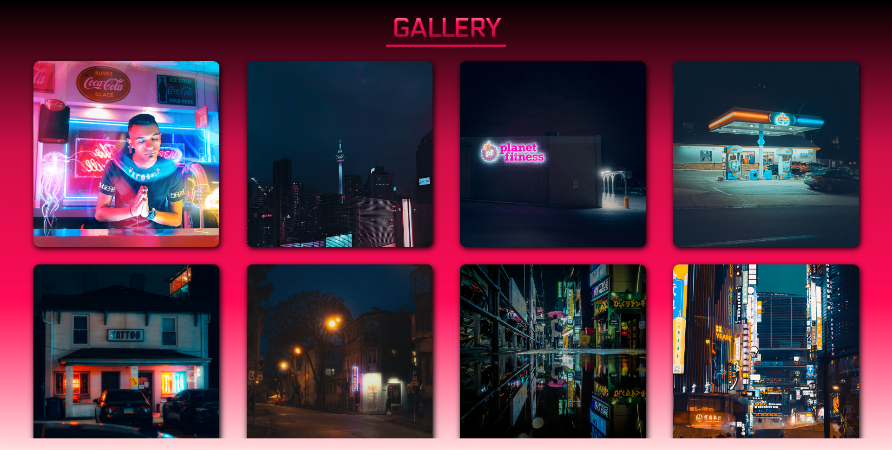

# 🖼️ Hover Effect Gallery

A visually dynamic **image gallery** featuring smooth hover animations, gradient backgrounds, and responsive card layouts.  
Built using **HTML** and **CSS**, this project highlights creative UI design, transition effects, and typography.

---

## ✨ Features

- 📸 Responsive image gallery layout  
- 🎨 Gradient background with modern color transitions  
- 🪄 Interactive hover effects on images and icons  
- 💫 Sliding overlay showing title and like button  
- 🔤 Custom font integration: *Electrolize-Regular*  
- 🧩 Scrollable image container with hidden scrollbar  

---

## 🌐 Live Demo / Review

You can view and interact with the project online here:  
👉 [Hover Effect Gallery Live Demo](https://harsh-codes-hub.github.io/Hover-Effect-TASK6/)

Explore the smooth hover animations, gradient backgrounds, and responsive card layout directly in your browser.

---

## 🗂️ File Structure
```
Hover-Effect-TASK6/
│
├── index.html # Main HTML file for gallery layout
├── style.css # CSS styling for layout and hover effects
│
├── /fonts/ # Custom font folder
│ └── Electrolize-Regular.woff2
│
├── /favicon/ # Website icons and manifest
│ ├── favicon-16x16.png
│ ├── favicon-32x32.png
│ ├── apple-touch-icon.png
│ └── site.webmanifest
│
├── README.md # Project documentation
│
└── preview.webp # preview image of page
```

---

## 💻 Usage

1. **Clone the repository:**
   ```bash
   git clone https://github.com/harsh-codes-hub/Hover-Effect-TASK6.git
   ```
2. **Navigate to the project directory:**
   ```bash
   cd Hover-Effect-TASK6
   ``` 
3. *Open the project in your browser*
   ```
   open index.html
   ```
   or simply double-click on **index.html**

---

## 🧠 Learning Highlights

- Practiced CSS transitions and hover animations
- Implemented flexbox for responsive layouts
- Applied custom gradients using CSS variables
- Created interactive overlays with text and icons
- Embedded custom fonts for a consistent design style

---

## 📸 Preview

A modern, gradient-themed gallery where each image slightly enlarges on hover, revealing a soft overlay at the bottom that displays a title and a heart icon button.



---

## 🛠️ Built With

- HTML5
- CSS3
- Flexbox
- Remix Icon
- Electrolize-Regular Font

---

## 👨‍💻 Author

**Cohort 2.0 – Batch Task 6 Submission**
Created by **Harsh Gajrani** *(Harsh Codes Hub)*
Part of the **Cohort 2.0 batch at Sheryians Coding School**

---

*⭐ If you found this project helpful or inspiring, please consider giving it a star on GitHub!*
